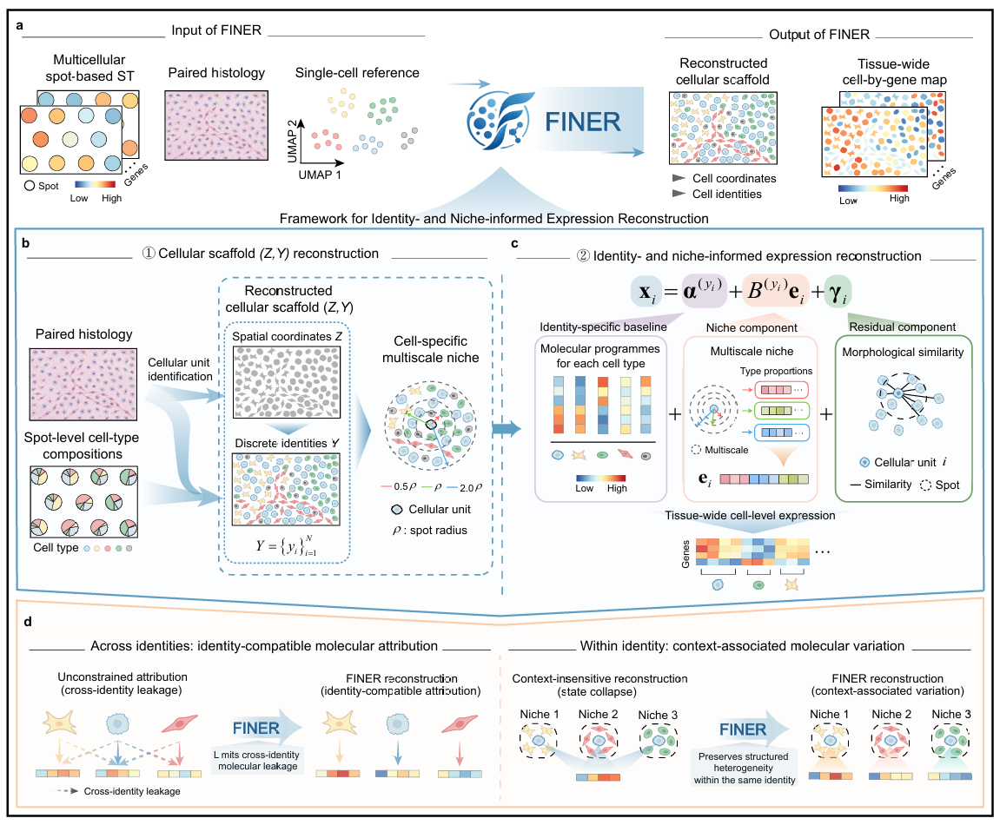

<h1> <p align="center">
    Reconciling cell identity with tissue context in cell-resolved spatial transcriptome reconstruction
</p> </h1>

**FINER**: Framework for Identity- and Niche-informed Expression Reconstruction.
<p align="center">
   
</p>


## Prerequisites

**FINER** has been developed and tested on **Ubuntu 18.04.2 LTS (GNU/Linux 4.15.0-213-generic x86_64)**. Before running the pipeline, please ensure the following dependencies and checkpoints are prepared:

1. **MILP Solver License**:
   FINER requires [Gurobi](https://www.gurobi.com/) and a valid license (e.g., Academic License) for the mixed-integer linear programming (MILP) identity-assignment step.

2. **Pretrained Feature Extractors**:
   FINER leverages pretrained RetCCL and HIPT encoders for multi-scale morphological feature extraction. Please download the following model checkpoints prior to feature construction:
   - **RetCCL**: `best_ckpt.pth`
   - **HIPT ViT-256**: `vit256_small_dino.pth`
   - **HIPT ViT-4K**: `vit4k_xs_dino.pth`

   > Detailed download links and directory placement instructions are provided in our [Prostate Cancer Tutorial](demos/Visium_Prostate_Cancer_Reproducibility.ipynb).
   
   
## Installation

Follow these steps to set up the **FINER** python environment:

1. **Clone the repository**:

    ```bash
    git clone https://github.com/KeJin13/FINER.git
    cd FINER
    ```

2. **Set up a Conda environment for FINER**:

    ```bash
    conda env create -f environment.yml
    conda activate FINER-env
    ```

3. **Install FINER**:
    
    ```bash
    pip install .
    ```
    

## Reproducibility & Real Data Applications

We provide source codes in the `demo/` directory to reproduce the main-text results and demonstrate FINER's performance across real spatial transcriptomics tissue datasets:

- **10x Visium Human Prostate Cancer**: [Visium_Prostate_Cancer_Reproducibility.ipynb](demo/Visium_Prostate_Cancer_Reproducibility.ipynb)
- **HER2-positive Human Breast Cancer**: [Her2-positive_Breast_Cancer_Reproducibility.ipynb](demo/Her2-positive_Breast_Cancer_Reproducibility.ipynb)


 
## Contact information
Please do not hesitate to contact Dr. Ke Jin (<kej13@mails.ccnu.edu.cn>), Liwei Wang (<wangliwei@mails.ccnu.edu.cn>) or Prof. Xiao-Fei Zhang (<zhangxf@ccnu.edu.cn>) to seek any clarifications regarding any contents.